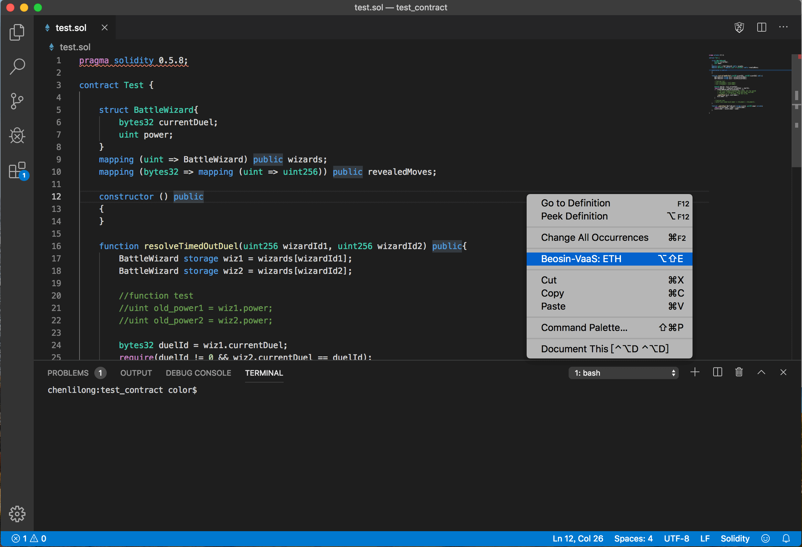

[中文](README.md)

# Beosin-VaaS: ETH  

### Introduction:
`Beosin-VaaS`: ETH is a customized tool which is developed for `Ethereum(ETH)` smart contract security testing. `Beosin-VaaS` is an automatic formal verification tool , can accurately locate the location of the code with risks and point out the reasons for the risks. It can effectively detect the conventional vulnerabilities of smart contract with an accuracy of over 95% and provide "military level" security verification for the smart contract code.  
`Beosin-VaaS: ETH` is capable of "one-click" automatic detection including 5 major and 27 minor routine vulnerabilities(Six of them are only available in enterprise edition)at present. New tests will be added as the version is updated.  
For Windows users, you need to make sure that your computer has `Node.js` and `Visual C++` libraries.  
`Node.js` download address: [https://nodejs.org/zh-cn/download/](https://nodejs.org/zh-cn/download/).  
`Visual C++` download address: [https://visualstudio.microsoft.com/zh-hans/downloads/](https://visualstudio.microsoft.com/zh-hans/downloads/), if choose other tools and `Microsoft Visual C++ Redistributable for Visual Studio 2019` in the framework to install.  
With `Beosin-VaaS:ETH` , The whole testing process is completed locally, which can eliminate the user's concerns about source code leakage. In addition, `Beosin-VaaS:ETH` implements `ETH` smart contract Code highlighting and Code completion based on `VS Code`, which is convenient for users to test in development, it can locate and help users modify problems quickly after the problems are found.  

### Installation:  
Open `VS Code`, in its extension supermarket, search `Beosin-VaaS: ETH`, and select install.  

### Usage:  
After installation, open contract project with `VS Code`, select contract file, right click (`Beosin-VaaS: ETH` option):  

The first time you select the `Beosin-VaaS: ETH` option, the following screen appears to select the compiler you want to use:

After the selection, the following interface will appear:  

After downloading, the following interface will appear:  

Click the `Settings` button (top right corner ⚙) part can customize the test parameters:  
- `Process Limit` represents the maximum number of simultaneous processes (`CPU` cores can be limited, the higher the number,  the shorter the test time)  
- `Time Limit` means time is limited, beyond which the test will automatically end.

Select the contract path to be tested, enter the name of the master contract, and click the `Start` button to start-up the test:

The test may take a while, please be patient to wait. If you want to stop the test, click the `End` button, and the results will shown as the results of the current test. After completion of the test, the final result is as below:  

### Update `Beosin-VaaS`: 
Hot key `ctrl+shift+p` (Mac OS X: `command+shift+p`), search `Beosin-VaaS: ETH - Update` and execute: 

### Result Introduction:  
At the moment,the test results of the tool can be divided into `5` major and `27` minor items(Six of them are only available in enterprise edition) according to the test content, and new items will be added with the iteration of the version. The available results are described by category as below.  
#### 1. Code Specification Testing
This major item specialized for the writing of some code specifications to test, totally `11` minor items.  
- 1.1 ERC Standard
Contains `ETH` common `ERC20`, `ERC721`, `ERC1400`, `ERC1404`, `ERC223`, `ERC777` and other common contract standard tests, to ensure that developers implement these standards correctly.  
- 1.2 Transfer To Zero Address  
In `transfer`, `transferFrom`, `transferOwnership` and other sensitive functions, user operations are irreversible, so it is recommended that developers add non-zero check of target address in the implementation of these functions to avoid user misoperation that may lead to loss of user rights and property.  
- 1.3 TX Origin Authentication  
`tx.origin` is a state variable of `Solidity` that iterates through the call stack and returns the address of the account that originally sent the call (or transaction).Using this variable for authentication in a smart contract makes the contract vulnerable to attacks like phishing.  
- 1.4 Constructor Mistyping  
The constructor is only called when the contract is deployed. The contract `owner` setting is usually placed in the constructor, and the contract's constructor also performs initialization. When a constructor is defined using `function`, if the function name is mismatched with the contract name, it becomes a normal function. Otherwise, the contract would then carry a significant security risk.  
- 1.5 Complex Code In Fallback Function  
The `fallback` function of the contract is usually used to receive an `ETH` transfer, but implementing overly complex logic in `fallback` can run out of `gas` and make the transfer unsuccessful.
- 1.6 Unary Operation  
An error occurs when the operation defined is intended to add a number to the variable `+=` but accidentally defines `=+` in the wrong way. Instead of calculating the sum, it reinitializes the variable.  
- 1.7 Redefine Variable From Base Contracts  
In `Solidity`, the same or different contract allows the existence of the same state variable, which does not constitute a direct threat. If a single one is equivalent to redefining the variable, the sequential relationship and wrong use will occur when the variable is inherited and used in multiple contracts, so try to avoid the occurrence of the same state variable.
- 1.8 Unused Variables  
Unspent variables are allowed in `Solidity`, which do not pose a direct security problem but reduce the readability of the code and take up additional storage space, resulting in increased resource consumption at deployment time.  
- 1.9 No Return  
If a function is declared to have a return value and is not given a return value, a default return value is generated, and the default return value may differ from the actual return value after execution.  
- 1.10 Overload Syscall  
For functions that have been built in for `Solidity`, such as `assert`, such as property_parse, exceptions may occur if they are redefined in the contract.  
- 1.11 Fake Recharge Vulnerability  
The `ERC20` contract may fail in the `transfer` function. In this case, the function does not exit with an exception, but `returns false;`. If the exchange determines whether the transfer is successful based on the state of the call, it will lead to an incorrect judgment.

#### 2、Function Call Detection
This major item is used to check the contract for possible problems when function calls are made. There are `5` minor items.
- 2.1 Invoke Low Level Calls  
`Call` is an underlying function provided by the `ETH` smart contract authoring language `Solidity`, which is used to interact with external contracts or libraries. When this kind of function is used, it is necessary to determine the security of the call parameters. `delegatecall` leaves the properties of the invocation environment unchanged, indicating that building a buggy free custom library is not as easy as people thought. The code in the library itself can be secure and bug-free, but when it runs in another application environment, new bugs may appear. Besides, a call to the `selfdestruct` suicide function will destroy the contract.  
- 2.2 Invoke Extcodesize  
`extcodesize` is zero at contract deployment time, and attackers can invoke the victim contract in their own constructor, at which point `extcodesize` validation is invalid.  
- 2.3 Invoke Ecrecover  
Both `keccak256()` and `ecrecover()` are built-in functions, `keccak256()` can be used to calculate the signature of the public key, and `ecrecover()` can be used to recover the signed public key. These two functions can be used to verify the address if the pass value is correct.But when the `ecrecover()` parameter error, return `0x0` address, if `_from` also passed `0x0` address, can pass the check.That is, anyone can transfer the balance of the `0x0` address out.  
- 2.4 Unchecked Call Or Send Return Values  
No exception is thrown directly after the `call`/`send` function is called on success or failure, and the function continues to execute if the call return value is not checked.  
- 2.5 Re Entrancy (Enterprise Edition)  
A faulty logic implementation in the contract may result in a reentry call, allowing the user to repeat the `Token`.  

#### 3、Business Logic Security Test
This large item is mainly used to check for problems that may cause security risks to the business logic. There are `6` testing items in total.  
- 3.1 Block Members Manipulation  
The risk of block parameter dependence mainly includes timestamp dependence and block hash dependence. This risk mainly comes from using them to generate random Numbers. Because they can be manipulated or obtained by attackers, they should not be used for random seeds.  
- 3.2 Arbitrary Jump with Function Type Variable  
Since `Solidity` does not support pointer arithmetic, it is not possible to change this variable to an arbitrary value. However, if the developer USES an assembly instruction (such as an assignment operator) in the worst case, the attacker can point a function type variable at any code instruction, violating the required validation and the required state change.  
- 3.3 Check This Balance  
Contract fund is strictly limited in contract code, and in most cases contract money is variable, so users can easily take advantage of this feature to prevent the functional logic of the contract from performing properly.  
- 3.4 Function Problem (Enterprise Edition)  
The function always ends up in an abnormal state like `revert()`, unable to `return` after normal execution, indicating a problem with the function design.  
- 3.5 Call Problem (Enterprise Edition)  
`Call` always fails, indicating a problem with function design.  
- 3.6 Denial Of Service (Enterprise Edition)  
The contract may be invoked in a malicious manner, resulting in a contract denial of service and other users being unable to properly invoke the contract.

#### 4、Overflow Detection
Overflow is a typical contract vulnerability, which may cause checks to be bypassed and the contract logic to fail. Among this major items, VaaS mainly carried out `3` small items of test.
- 4.1 Exponent Arithmetic Overflow
- 4.2 Integer Overflow
- 4.3 Integer Underflow

#### 5、 Abnormal Reachable Status Detection
There are `2` items to detect the most possible abnormal conditions during contract execution.  
- 5.1 Assert Fail (Enterprise Edition)  
The constraint condition of `assert` must be satisfied, and an error will be reported in the case that the condition may not be satisfied, indicating that the contract running state is abnormal.  
- 5.2 Require Fail (Enterprise Edition)  
Similar to `assert`, the default `reqiure` condition is possible, and an error is reported when the condition cannot be met under any circumstances, indicating that the contract is in an abnormal state.  

### Business Logic Test:  
Because `VaaS` supports exception reachable state detection, you could test your function's business logic for problems by adding `require` and `assert` when using VaaS.The following is a simple illustration of the recently revealed `Cheeze Wizards` hole in the ethereum gaming contract:  

The above is a simple implementation of the `resolveTimeOutDuel` problem function in the contract. If it is detected directly by `VaaS`, it will not find any problem.  

According to the description of the function, `resolveTimeOutDuel` is called when a duel timeout occurs, and when certain conditions are met, `wiz2`'s `power` is transferred to `wiz1`. According to this logic, we can easily conclude that `wiz1.power+wiz2.power` before the execution of the function should be the same as `wiz1.power+wiz2.power` after the execution, whether the condition is satisfied or not. So you can add code at the beginning and end of the function to describe this logic:  

Thus, when testing through `VaaS`, line `35` will report `Assert Fail`:  

It indicates that the total number of `power` before and after execution may change, and the contract design has problems. A bit of checking shows that `wiz1.power` is set to `0` when `wiz1 == wiz2`, so you need to add the `require(wiz1 != wiz2)`.  

### Editions Notes:  
This edition is a free `VS Code` plugin for both individuals and developers.For smart contracts with high security requirements and complex business logic, it is recommended to select our enterprise edition tools or expert auditing services to further audit contract security. The differences between the free edition, enterprise edition and auditing services are as below:  

Free online and offline Editions are available in Chengdu LianAn [One-stop Security Service Platform](https://www.beosin.com) . Any comments and suggestions in use, or need enterprise edition or auditing services, please contact us as the following: 

[Chengdu LianAn](https://www.lianantech.com/#/?index=4)